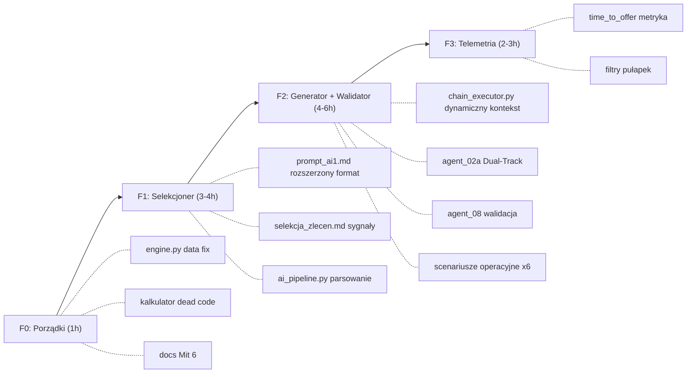

# PLAN WDROŻENIA ZMIAN W BOCIE — Na Podstawie Strategii

> Kolejność: od najprostszego i najbezpieczniejszego do architektonicznego.
> Każda faza jest niezależnie wdrażalna — nie musisz robić wszystkiego naraz.

---

## FAZA 0: Porządki (1h, zero ryzyka)

Zmiany, które niczego nie psują, a usuwają tykające bomby i martwy kod.

### 0.1 — Hardcoded data w engine.py
- **Plik**: `kod/engine.py` linia 213
- **Co**: `"2026-09-21"` → `(datetime.now() - timedelta(days=5)).strftime("%Y-%m-%d")` (lub inna logika, którą ta data miała realizować — filtr "zalegających" zleceń z magazynu)
- **Ryzyko**: Żadne. Data za chwilę przestanie mieć sens.

### 0.2 — Martwy kod w wycena_kalkulator.py
- **Plik**: `kod/wycena_kalkulator.py` linie 162-170
- **Co**: Usunąć blok `if is_tier_a / elif stawka_godzinowa_klienta / else` (linie 162-169) — jest nadpisany przez linię 170 `stawka = STAWKA_EFEKTYWNA`. Zostawić jedną linię: `stawka = STAWKA_EFEKTYWNA`.
- **Powiązane**: Usunąć lub skomentować `wylosuj_stawke()` i `stawka_dla_oferty()` (linie 58-77) — zawsze zwracają 90.
- **Ryzyko**: Żadne. Zachowanie kodu się nie zmienia.

### 0.3 — Usunięcie wzmianki o Faza 1 PoC z docs
- **Plik**: `badania/schemat_bota/krok_03_kalkulacja_wyceny.md` linia 24
- **Co**: Usunąć: *"chyba że zakres ewidentnie wymaga 50 godzin pracy (wtedy następuje podział na Faza 1 PoC)"*. Strategia (Mit 6, Stopień 4) mówi: **0% konwersji na Faza 1**. Zakaz samowolnego cięcia.
- **Zastąpić**: *"Bot wycenia pełny zakres. Cięcie na MVP dopuszczalne wyłącznie gdy konkurencja pod zleceniem tak wycenia lub klient wprost żąda fazowania."*

### 0.4 — Spójność portu proxy w docs
- **Plik**: `kod/tech/AI_INTEGRACJA.md`
- **Co**: Zamienić 4570 → 4571 (kod używa 4571).

---

## FAZA 1: Inteligentny Selekcjoner (3-4h)

Cel: selekcjoner AI (`prompt_ai1.md` + `ai_pipeline.py`) zwraca nie tylko BIERZEMY/Tier, ale też **ścieżkę Dual-Track**, **typ klienta** i **modyfikatory**. Reszta pipeline'u (generator, walidator) jeszcze tego nie konsumuje — to Faza 2.

### 1.1 — Rozszerzenie formatu werdyktu selekcjonera

**Plik**: `kod/prompts/generatory/prompt_ai1.md`

**Zmiana**: Do instrukcji formatu odpowiedzi JSON dodać wymagane pola:

```json
{
  "id": "144890",
  "werdykt": "BIERZEMY",
  "tier": "TIER_A",
  "sciezka": "inzynieria",
  "typ_klienta": "ekspert_dziedzinowy",
  "modyfikatory": ["RESCUE"],
  "powod": "..."
}
```

Definicje pól (do wklejenia w prompt):
- `sciezka`: `"inzynieria"` (klient wymienia technologię) lub `"biznes"` (klient opisuje ból operacyjny bez żargonu IT).
- `typ_klienta`: jeden z: `msp_erp`, `ecommerce`, `agencja`, `ekspert_dziedzinowy`, `tech_agnostic`, `quick_fix`.
- `modyfikatory`: lista z: `RESCUE` (po ucieczce wykonawcy, audyt, dokończenie), `DELEGOWANY` (pisze pracownik w imieniu szefa), `PHANTOM` (wizjoner bez budżetu, equity zamiast pieniędzy).

### 1.2 — Rozszerzenie selekcja_zlecen.md o sygnały ekspertów

**Plik**: `kod/prompts/kontekst/selekcja_zlecen.md`

**Zmiana**: Dodać do definicji Tier A:
- Sygnały eksperta dziedzinowego: gabinet, klinika, komornik, kancelaria, RODO, dokumentacja medyczna, monitoring ksiąg, forensic
- Sygnały RESCUE: "poprzedni wykonawca", "dokończenie", "audyt kodu", "porzucony projekt"
- Sygnały pułapek do odrzucenia: "etat", "ATS", "dołączenie do zespołu", "na stałe", "widełki godzinowe", "wspólnik techniczny" + budżet < 200 PLN

### 1.3 — Parsowanie nowych pól w ai_pipeline.py

**Plik**: `kod/ai_pipeline.py`, metoda `filter_offers()` (linie ~200-230)

**Zmiana**: Obok `tiery[jid] = tier` dodać parsowanie:
```python
sciezki[jid] = str(item.get("sciezka", "inzynieria")).lower()
typy[jid] = str(item.get("typ_klienta", "")).lower()
modyfikatory_map[jid] = item.get("modyfikatory", [])
```

I w pętli budowania `zakwalifikowane`:
```python
o["sciezka"] = sciezki.get(oid, "inzynieria")
o["typ_klienta"] = typy.get(oid, "")
o["modyfikatory"] = modyfikatory_map.get(oid, [])
```

**Zależności**: Żadne. Te pola po prostu przechodzą przez pipeline jako dane — generator ich jeszcze nie konsumuje.

### 1.4 — Przekazanie nowych pól do chain_executor

**Plik**: `kod/chain_executor.py`, funkcja `run_chain()` (~linia 420-440)

**Zmiana**: W sekcji normalizacji `zlecenie_dane` upewnić się, że `sciezka`, `typ_klienta`, `modyfikatory` są zachowane w danych przekazywanych do `_build_prompt()`. Pole `tier` już jest przekazywane (linia ~556).

---

## FAZA 2: Generator i Walidator świadomi kontekstu (4-6h)

Cel: Agent 02a pisze inaczej do klienta tech-agnostic niż do inżyniera. Agent 08 to waliduje. Chain executor podłącza dynamiczny kontekst.

### 2.1 — Dynamiczne ładowanie scenariusza klienta

**Plik**: `kod/chain_executor.py`, funkcja `_build_prompt()`

**Zmiana**: Dodać logikę:
```python
# Po załadowaniu statycznych context_files:
typ = context.get("_zlecenie", {}).get("typ_klienta", "")
sciezka = context.get("_zlecenie", {}).get("sciezka", "inzynieria")

# Scenariusz klienta (jeśli istnieje)
scenario_map = {
    "msp_erp": "scenariusze/klient_01_tradycyjne_msp_erp_przemysl.md",
    "ecommerce": "scenariusze/klient_02_ecommerce_merchant.md",
    "agencja": "scenariusze/klient_03_agencja_software_house.md",
    "ekspert_dziedzinowy": "scenariusze/klient_04_ekspert_dziedzinowy_uslugi.md",
    "tech_agnostic": "scenariusze/klient_05_tech_agnostic_biznes.md",
    "quick_fix": "scenariusze/klient_06_quick_fix_awaria_hobbysta.md",
}
scenario_file = scenario_map.get(typ)
if scenario_file:
    scenario_path = PROMPTS_DIR / "kontekst" / scenario_file
    if scenario_path.exists():
        user_parts.append(f"--- PROFIL KLIENTA ---\n{_read_text(scenario_path)}")
```

**Wymagane**: Skopiować (lub symlinknąć) wybrane scenariusze z `badania/analizy/typy_klientow/scenariusze/` do `kod/prompts/kontekst/scenariusze/`. Ale **nie kopiować dosłownie** — audyt Red Team mówi, że są za długie i za literackie. Trzeba stworzyć **operacyjne wersje** (skrócone o 50-60%, bez metafor, z sekcjami MINIMUM OPERACYJNE i KONKRET KTÓRY MUSI PAŚĆ).

> [!IMPORTANT]
> To jest największy kawałek pracy w całym planie. Scenariusze trzeba przerobić z 400-linijkowych portretów psychologicznych na 80-100 linijkowe instrukcje operacyjne dla AI.

### 2.2 — Instrukcja Dual-Track w prompcie 02a

**Plik**: `kod/prompts/generatory/agent_02a_opis_oferty.md`

**Zmiana**: Dodać sekcję:
```
--- KLASYFIKACJA DUAL-TRACK ---
Pole `sciezka` w danych zlecenia określa ton oferty:
- "inzynieria": Precyzja stacku, biblioteki, protokoły API, CTA o architekturę/bazę.
- "biznes": ZERO żargonu IT. Język rezultatu operacyjnego. CTA o format danych wejściowych lub proces biznesowy klienta. Zakaz: Docker, React, framework, deployment, API (chyba że klient SAM użył tego słowa).
```

### 2.3 — Walidacja Dual-Track w agencie 08

**Plik**: `kod/prompts/walidatory/agent_08_weryfikacja_zasad.md`

**Zmiana**: Dodać test nr 6:
```
6. TEST DUAL-TRACK:
   - Jeśli sciezka == "biznes": oferta NIE MOŻE zawierać żargonu IT (nazwy frameworków, baz danych, języków programowania), CHYBA ŻE klient sam użył tych słów w ogłoszeniu.
   - Jeśli sciezka == "inzynieria": oferta MUSI zawierać minimum 1 konkret techniczny (nazwa biblioteki, protokołu, narzędzia).
   - FAIL z POPRAW_OFERTA jeśli naruszono.
```

### 2.4 — Walidacja jakości CTA

**Plik**: `kod/prompts/walidatory/agent_08_weryfikacja_zasad.md`

**Zmiana**: Rozbudować test CTA:
```
4. TEST CTA (rozszerzony):
   - Oferta MUSI kończyć się pytaniem decyzyjnym (nie "zapraszam do kontaktu").
   - Dla sciezka == "inzynieria": pytanie o architekturę, stack, bazę danych.
   - Dla sciezka == "biznes": pytanie o format danych wejściowych, obecny proces, oczekiwany rezultat.
   - Zakaz proponowania calli/spotkań wideo (Mit 2, Stopień 4).
```

---

## FAZA 3: Telemetria i bezpieczeństwo (2-3h)

### 3.1 — Logowanie time_to_offer

**Plik**: `kod/engine.py` (sekcja po udanej wysyłce, ~linia 480-490)

**Zmiana**: Po `storage.update_job(job_id, {"status": "WYSLANO", "data_wyslania": ...})` dodać:
```python
detected_at = job_data.get("detected_at")
if detected_at:
    from datetime import datetime
    try:
        dt_detected = datetime.fromisoformat(detected_at)
        dt_sent = datetime.now()
        time_to_offer_s = (dt_sent - dt_detected).total_seconds()
        storage.update_job(job_id, {"time_to_offer_s": round(time_to_offer_s)})
        print(f"[METRYKA] Czas od wykrycia do wysłania: {time_to_offer_s/60:.1f} min")
    except Exception:
        pass
```

**Cel**: Walidacja Hipotezy 2.5 (< 30 min = +50% szansa).

### 3.2 — Deterministyczne filtry pułapek

**Plik**: `kod/engine.py` (przed wysłaniem do selekcjonera AI, ~linia 255)

**Zmiana**: Dodać filtr PRZED AI:
```python
# Pułapki ogłoszeń (filtr_pulapki_ogloszen.md)
TRAP_KEYWORDS = ["etat", "ats", "dołączenie do zespołu", "na stałe", 
                 "widełki godzinowe", "umowa o pracę", "b2b stałe"]
title_lower = (job.get("title", "") + " " + job.get("full_description", "")).lower()
if any(kw in title_lower for kw in TRAP_KEYWORDS):
    storage.update_job(job_id, {"status": "ODRZUCONA_PULAPKA_REKRUTACJA"})
    continue
```

### 3.3 — Alert o nowej wiadomości priv (opcjonalnie)

**Plik**: Nowy plik `kod/alert_priv.py` (lub rozszerzenie `zbieracz_danych.py`)

**Zmiana**: Prosty polling API Useme `/pl/mesg/mesgs/` (priv_engine.py już ma `pobierz_liste_watkow()`) + wysłanie powiadomienia przez Telegram Bot API lub Pushover gdy pojawi się nowa wiadomość.

**Zależności**: Wymaga tokena Telegram/Pushover. Osobna decyzja.

---

## DIAGRAM ZALEŻNOŚCI



---

## 4 DECYZJE DO PODJĘCIA PRZED STARTEM

1. **Scenariusze klientów** — czy skracamy istniejące 9 scenariuszy do wersji operacyjnych (80-100 linii każdy) i kopiujemy do `kod/prompts/kontekst/scenariusze/`, czy tworzymy od zera nowe, krótsze karty?

2. **Karty technologiczne** — czy 16 kart z `badania/analizy/technologie/baza_wiedzy/` są gotowe do dynamicznego podczepiania w chain_executor, czy wymagają rewizji? (To opcjonalne wzmocnienie Fazy 2.)

3. **Faza 3.3 alert priv** — Telegram, Pushover, email, czy na razie pominąć?

4. **Kolejność pracy** — zaczynamy od F0 + F1 teraz, F2 osobno, czy lecisz cały plan od razu?
