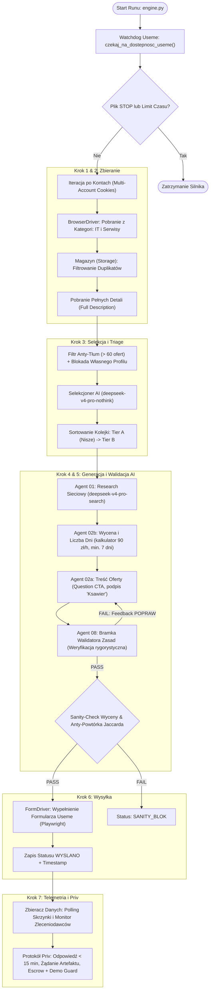

# ARCHITEKTURA GŁÓWNA SILNIKA BOTA (Stan Produkcyjny)

Niniejszy dokument przedstawia całościowy schemat działania produkcyjnego silnika bota zlokalizowanego w katalogu [`kod/`](file:///c:/Users/Ksawier/Pictures/Screenshots/Projekty_autorskie/useme_core/kod/).

---

## 1. Diagram Przepływu Danych (End-to-End State Machine)

---

## 2. Kluczowe Komponenty Systemowe

| Komponent | Plik Źródłowy | Rola i Odpowiedzialność |
|:---|:---|:---|
| **Silnik Koordynacyjny** | [`kod/engine.py`](file:///c:/Users/Ksawier/Pictures/Screenshots/Projekty_autorskie/useme_core/kod/engine.py) | Główna pętla wykonawcza, multi-account, limity czasu, obsługa wyjątków |
| **Sterownik Przeglądarki** | [`kod/browser_driver.py`](file:///c:/Users/Ksawier/Pictures/Screenshots/Projekty_autorskie/useme_core/kod/browser_driver.py) | Playwright, zarządzanie kontekstem sesji, ciasteczka, omijanie Cloudflare |
| **Magazyn Danych** | [`kod/storage.py`](file:///c:/Users/Ksawier/Pictures/Screenshots/Projekty_autorskie/useme_core/kod/storage.py) | Lokalna baza JSON, deduplikacja per zlecenie i per konto, checkpointy |
| **Łańcuch AI** | [`kod/ai_pipeline.py`](file:///c:/Users/Ksawier/Pictures/Screenshots/Projekty_autorskie/useme_core/kod/ai_pipeline.py) | Izolowana warstwa AI, interfejs `filter_offers` oraz `generate_proposal` |
| **Egzekutor Slotów** | [`kod/chain_executor.py`](file:///c:/Users/Ksawier/Pictures/Screenshots/Projekty_autorskie/useme_core/kod/chain_executor.py) | Sekwencyjne odpalanie agentów AI, pętla retry, parsowanie tagów i JSON |
| **Sterownik Formularza** | [`kod/form_driver.py`](file:///c:/Users/Ksawier/Pictures/Screenshots/Projekty_autorskie/useme_core/kod/form_driver.py) | Automatyczne wpisywanie stawek, dni i treści na Useme, obsługa błędów sesji |
| **Zbieracz Informacji Zwrotnej**| [`kod/zbieracz_danych.py`](file:///c:/Users/Ksawier/Pictures/Screenshots/Projekty_autorskie/useme_core/kod/zbieracz_danych.py) | Weryfikacja skrzynki Useme, sprawdzanie czy minął timeout, aktualizacja statusów |
