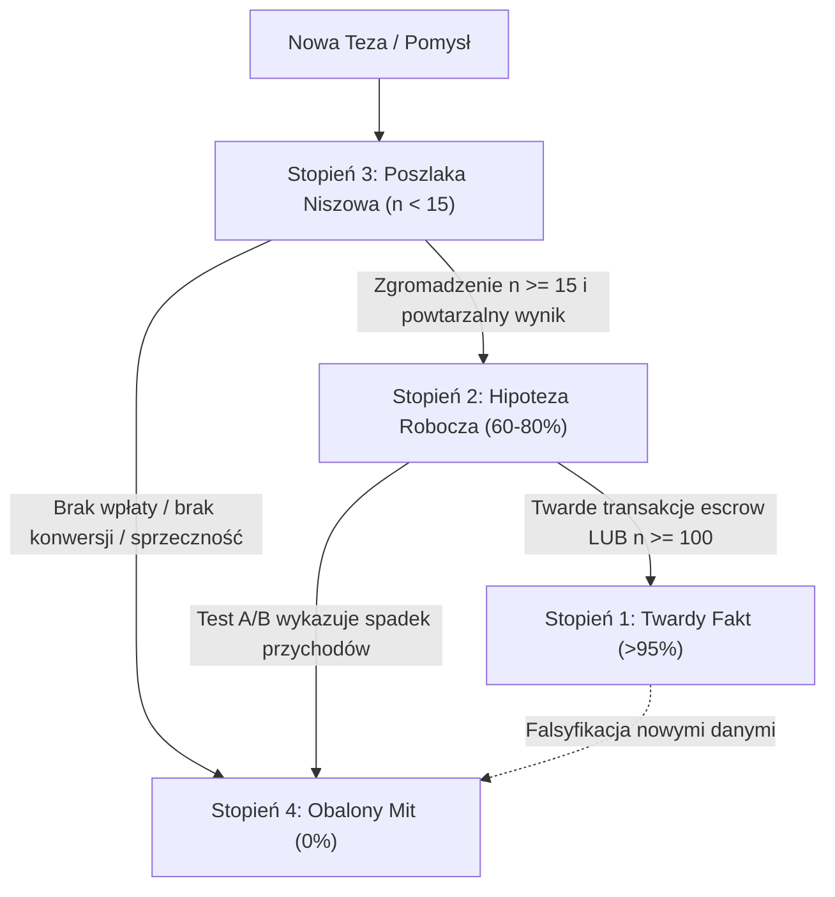

# STREFA 3: Teorie i Hipotezy (Zarządzanie Poziomami Pewności)

Strefa 3 stanowi filtr metodologiczny i "strefę brudną" przed wdrożeniem zmian bezpośrednio do silnika bota (`kod/`). Zapobiega wdrażaniu niesprawdzonych pomysłów, mitów marketingowych oraz pochopnych wniosków z małych prób statystycznych.

---

## 1. Cztery Stopnie Pewności

| Poziom | Nazwa Pliku | Próg Pewności | Kryteria Kwalifikacji | Zastosowanie w Bocie |
|:---:|:---|:---:|:---|:---|
| **Stopień 1** | [`01_stopien_twarde_fakty.md`](file:///c:/Users/Ksawier/Pictures/Screenshots/Projekty_autorskie/useme_core/badania/teorie/01_stopien_twarde_fakty.md) | **> 95%** | Twardy przelew z Useme (escrow), próba $n \ge 100$ zleceń, determinizm platformy | Wbudowane na stałe w kod silnika i walidatorów |
| **Stopień 2** | [`02_stopien_hipotezy_robocze.md`](file:///c:/Users/Ksawier/Pictures/Screenshots/Projekty_autorskie/useme_core/badania/teorie/02_stopien_hipotezy_robocze.md) | **60% – 80%** | Silna korelacja rynkowa ($15 \le n < 100$), powtarzalne wzorce behawioralne | Aktywne reguły w promptach i selekcji AI |
| **Stopień 3** | [`03_stopien_poszlaki_niszowe.md`](file:///c:/Users/Ksawier/Pictures/Screenshots/Projekty_autorskie/useme_core/badania/teorie/03_stopien_poszlaki_niszowe.md) | **20% – 40%** | Mała próba ($n < 15$), pojedyncze casy Ksawiera, błąd $\pm 30\%$ | Eksperymenty, reguły Fast-Track z ostrożnością |
| **Stopień 4** | [`04_stopien_obalone_mity.md`](file:///c:/Users/Ksawier/Pictures/Screenshots/Projekty_autorskie/useme_core/badania/teorie/04_stopien_obalone_mity.md) | **0%** | Falsyfikacja faktami transakcyjnymi, nieopłacone phantom leads | Bezwzględny zakaz implementacji w bocie |

---

## 2. Cykl Życia Tezy (Protokół Promocji i Degradacji)

### Reguły:
1. **Żadna teza nie trafia do Stopnia 1 bez twardego dowodu transakcyjnego** (potwierdzonego wpływu środków na rachunek bankowy Ksawiera z Useme).
2. Jeśli "wysoka wycena" nie kończy się wpłatą escrow w terminie 14 dni od wiadomości prywatnej, zostaje automatycznie zaklasyfikowana jako **Phantom Lead** i zdegradowana do Stopnia 4.
3. Wszelkie zmiany w promptach bota (`kod/prompts/`) muszą czerpać wyłącznie ze Stopnia 1 oraz Stopnia 2.

---

## 3. Wykaz Notatek Atomowych (Bieżące Dyskusje i Dylematy)

* [`teoria_problem_startupowcy_diagnoza.md`](file:///c:/Users/Ksawier/Pictures/Screenshots/Projekty_autorskie/useme_core/badania/teorie/teoria_problem_startupowcy_diagnoza.md) — Problem startupowców: 4 hipotezy (cena, autorytet, język, darmowa wycena) zamiast pochopnego skreślania.
* [`teoria_stosunek_klientow_do_ai_i_pulapka_cynizmu.md`](file:///c:/Users/Ksawier/Pictures/Screenshots/Projekty_autorskie/useme_core/badania/teorie/teoria_stosunek_klientow_do_ai_i_pulapka_cynizmu.md) — Klient AI-Pragmatyk (Dominik Łyżwa) vs AI-Sceptyk; pułapka hejtowania AI i pułapka cynicznego odwracania ról.
* [`teoria_pytania_cta_i_granica_priv.md`](file:///c:/Users/Ksawier/Pictures/Screenshots/Projekty_autorskie/useme_core/badania/teorie/teoria_pytania_cta_i_granica_priv.md) — 1 pytanie czy 2-3 pytania techniczne? Gdzie kończy się bot, a gdzie wchodzi człowiek.
* [`teoria_struktura_pytania_w_srodku_i_autentycznosc.md`](file:///c:/Users/Ksawier/Pictures/Screenshots/Projekty_autorskie/useme_core/badania/teorie/teoria_struktura_pytania_w_srodku_i_autentycznosc.md) — Pytanie wplecione w środek tekstu (tok myślenia inżyniera) oraz twardy zakaz udawania mowy ludzkiej w tekście.
* [`teoria_pulapka_poligonu_wordpress.md`](file:///c:/Users/Ksawier/Pictures/Screenshots/Projekty_autorskie/useme_core/badania/teorie/teoria_pulapka_poligonu_wordpress.md) — WordPress jako poligon testowy oraz ostrzeżenie przed zafałszowaniem statystyk (WordPress Bias).

