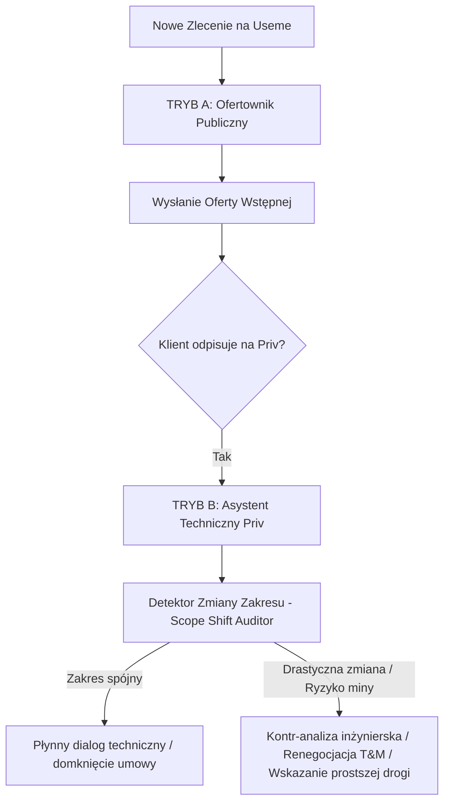

# Pomysł: Architektura Priv vs Oferta Publiczna i Detekcja Zmiany Zakresu (Scope Shift)

> **Status:** Pomysł badawczy / Koncepcja przyszłego modułu  
> **Lokalizacja:** `teorie/pomysly/pomysl_01_detekcja_priv_vs_oferta_i_zmiana_zakresu.md`  
> **Geneza empiryczna:** Zlecenie #145003 (Tegra 2 / automotive dla firmy Naviproject)

---

## 1. Problem: Rozdźwięk między Ofertą Publiczną a Dialogiem na Priv

Aktualny bot (`useme_core`) został zaprojektowany wyłącznie do obsługi **pierwszego etapu lejka**:
1. Scrapowanie publicznego zlecenia na Useme.
2. Generowanie oferty wstępnej (stawka, czas, argumentacja merytoryczna, pytanie techniczne).
3. Wysłanie formularza ofertowego.

### Co dzieje się w rzeczywistości po wygraniu kontaktu?
Klient odpisuje w wiadomościach prywatnych (na privie Useme lub przechodzi na telefon/maila) i **bardzo często całkowicie wywraca zakres zlecenia do góry nogami**.

### Przykład empiryczny (Case Study #145003 - Tegra 2):
* **W ogłoszeniu publicznym:** Klient szuka kogoś do „ominięcia zabezpieczeń w architekturze Nvidia Tegra 2”, budżet 13 000 PLN, czas 24 dni. Bot składa trafną, zwięzłą ofertę i pyta o dostępność płytki.
* **Na privie (rzeczywistość techniczna):** Klient doprecyzowuje, że chodzi o **atak Fault Injection (Voltage Glitching) na działający system operacyjny (Linux + TrustZone / OP-TEE) w locie (runtime)** w celu wyciągnięcia kluczy kryptograficznych (HUK / Secure Storage).
* **Konsekwencja:** Zadanie z poziomu „sprawdzenie BootROM-u na starcie procesora” przeskoczyło do poziomu „przełamywanie TrustZone na żywym jądrze z wielozadaniowością, jitterem czasowym i kondensatorami filtrującymi”. Na rynku komercyjnym laboratoria biorą za to 20 000 – 60 000 EUR na sprzęcie za miliony złotych, bez gwarancji sukcesu.

Gdyby bot na privie odpowiedział jak typowy automat ofertowy („Chętnie to zrobię w 24 dni za 13 000 zł”), programista wpakowałby się na gigantyczną minę.

---

## 2. Koncepcja Rozwiązania: Dwa Odmienne Tryby Bota

Bot w przyszłości musi posiadać **dwa rozłączne stany behawioralne**:

### Tryb A: Ofertownik Publiczny (Aktualny silnik)
* **Cel:** Wzbudzić ciekawość, pokazać hermetyczną wiedzę inżynierską, odsiać amatorów, zadać jedno celne pytanie, wywołać reakcję klienta.
* **Format:** Zwięzła oferta, 150-250 słów, zero lania wody, brak deklarowania drogiego sprzętu, stawka 90 zł/h lub widełki rynkowe.

### Tryb B: Asystent Techniczny Priv (Nowy moduł)
* **Cel:** Konsulting inżynierski, ochrona przed nierentownymi projektami, budowanie pozycji eksperta partnerskiego, renegocjacja warunków.
* **Format:** Bezpośrednia wiadomość czatowa (styl programista-programista), punktowanie faktów technicznych, zero formułek „Szanowny Panie, dziękuję za wiadomość”.

---

## 3. Moduł: Scope Shift Detector (Detektor Zmiany Zakresu)

Gdy na priv pojawia się nowa wiadomość od klienta, bot porównuje:
1. `Brief_Pierwotny` (z bazy zlecenia).
2. `Nowa_Wiadomosc_Klienta` (z czatu priv).

### Sygnały Alarmowe (Red Flags) do wykrywania przez AI:
1. **Przeskok złożoności technologicznej:**
   * Np. BootROM -> Runtime TrustZone / OP-TEE.
   * Np. Zwykła integracja API -> Reverse engineering binarnego protokołu bez dokumentacji.
   * Np. Prosta strona WP -> Autorski system ERP z synchronizacją multi-magazynową w czasie rzeczywistym.
2. **Niewykonalność w budżecie / czasie:**
   * Wycena rynkowa zadania jest 5-10x wyższa niż budżet klienta.
3. **Ryzyko fizycznego uszkodzenia / degradacji:**
   * Prace na pojedynczym egzemplarzu rzadkiego sprzętu (np. wylutowywanie kondensatorów SMD, ryzyko uceglenia płytki).
4. **Nierealistyczny model rozliczenia:**
   * Klient żąda "płatności za efekt" (success fee) przy zadaniach badawczo-naukowych (R&D / exploitacja zabezpieczeń).

---

## 4. Wzorce Odpowiedzi na Priv (Gdy zakres się zmienia)

Gdy wykryto `Scope Shift`, bot na priv nie powinien uciekać ani ślepo akceptować zlecenia. Zamiast tego wdraża **3-etapową strategię inżynierską**:

### Krok 1: Techniczne zdefiniowanie rzeczywistości (Sprowadzenie na ziemię)
Pokazanie klientowi, dlaczego jego nowy pomysł jest o rząd wielkości trudniejszy niż pierwotny brief:
> *„Ominięcie weryfikacji podpisu TA w locie (runtime VFI) na działającym Linuksie z TEE to zupełnie inna kategoria trudności niż glitching BootROM-u. Przy aktywnym wielozadaniowym Linuksie, obsłudze przerwań i aktywnym cache, jitter czasowy wynosi dziesiątki mikrosekund, co uniemożliwia trafienie pojedynczym impulsem bez dedykowanego zaawansowanego triggera sprzętowego.”*

### Krok 2: Zaproponowanie prostszych, tańszych alternatyw
Klient często forsuje trudną metodę, bo nie zna łatwiejszych:
* Czy klucze w RAM nie leżą w postaci jawnej podczas pracy oryginalnej aplikacji?
* Czy sprawdzono podatności czysto programowe w aplikacji TEE (np. memory corruption / buffer overflow w wywołaniach `TEEC_InvokeCommand`), co pozwoliłoby wykonać kod bez użycia lutownicy i generatora impulsów?
* Czy Linux na urządzeniu ma uprawnienia root / dostęp do `/dev/mem`?

### Krok 3: Zmiana modelu rozliczenia (z Fixed-Price na Etap Badawczy / T&M)
* Zabezpieczenie freelancera: zadania typu reverse engineering / exploitacja nie mogą być realizowane na zasadzie „płacę tylko, gdy wyjmiesz klucz za 13k”.
* Propozycja: płatny audyt wstępny (np. 3-5 dni roboczych za stałą stawkę) na zbadanie podatności programowych i weryfikację realności ataku.

---

## 5. Architektura Implementacyjna (Plan na przyszłość)

1. **Scraper / Poller wiadomości priv Useme:**
   * Nasłuchiwanie endpointów Useme (`/messages` lub websocket/polling).
   * Zapisywanie wątków powiązanych z `job_id`.
2. **Stan w bazie SQLite / JSON:**
   * Obiekt zlecenia otrzymuje pole `status_relacji`: `OFERTA_WYSLANA` -> `KLIENT_ODPISAL_PRIV` -> `ANALIZA_ZAKRESU` -> `DOPRECYZOWANIE`.
3. **Chain LLM dla wiadomości Priv:**
   * Prompt systemowy: Ekspert Techniczny / Architekt Oprogramowania.
   * Wejście: Pełna historia wątku (pierwotna oferta + wszystkie wiadomości klienta).
   * Wyjście: Sugerowana treść wiadomości prywatnej + flaga rekomendacji (czy brać, czy renegocjować, czy odpuścić).
